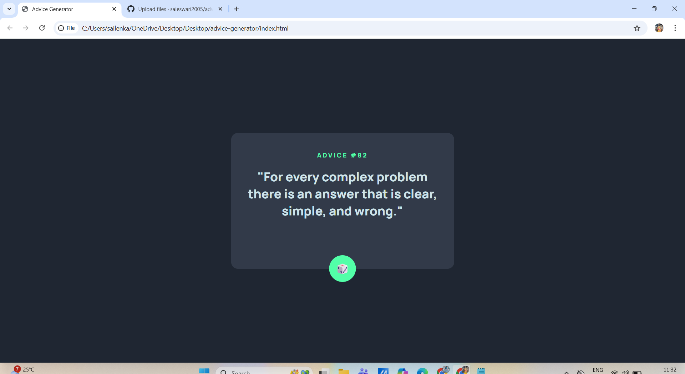

# Advice Generator App

## The Challenge

The goal of this project is to build a simple Advice Generator application using the Advice Slip API.  
The application displays a random piece of advice and allows users to generate new advice by clicking a dice button.

---
## Screenshot Preview

---

## Built With

- HTML
- CSS
- JavaScript
- Advice Slip API

---

## Features

- Displays random advice fetched from an external API
- Generates new advice on button click
- Responsive layout for mobile and desktop screens
- Hover effects for interactive elements

---

## How to Run the Project

1. Download or clone this repository
2. Open the `index.html` file in any modern web browser
3. Click the dice button to generate new advice

---

## Live Demo

https://saieswari2005.github.io/advice-generator/

---

## What I Learned

Through this project, I learned:
- How to structure a frontend project using HTML, CSS, and JavaScript
- How to fetch and use data from a public API
- How to handle user interactions using JavaScript
- How to deploy a project using GitHub Pages
- How to create a clear and meaningful README file for a project

---

## Author

**Sai Eswari**  
GitHub: https://github.com/saieswari2005

---

## Acknowledgements

- Frontend Mentor for the project idea
- Advice Slip API for providing free advice data

---

## License

This project is created for learning and practice purposes.

